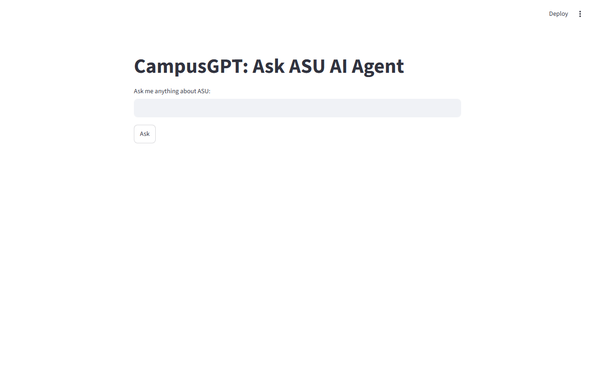
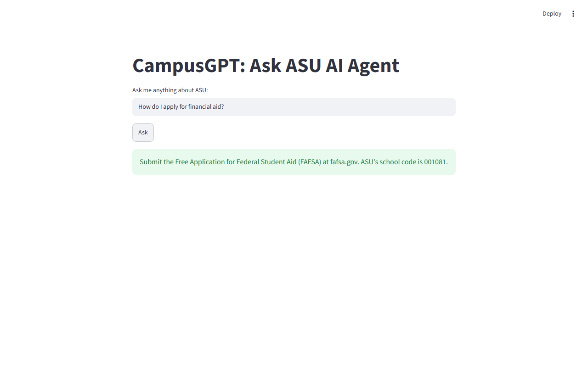
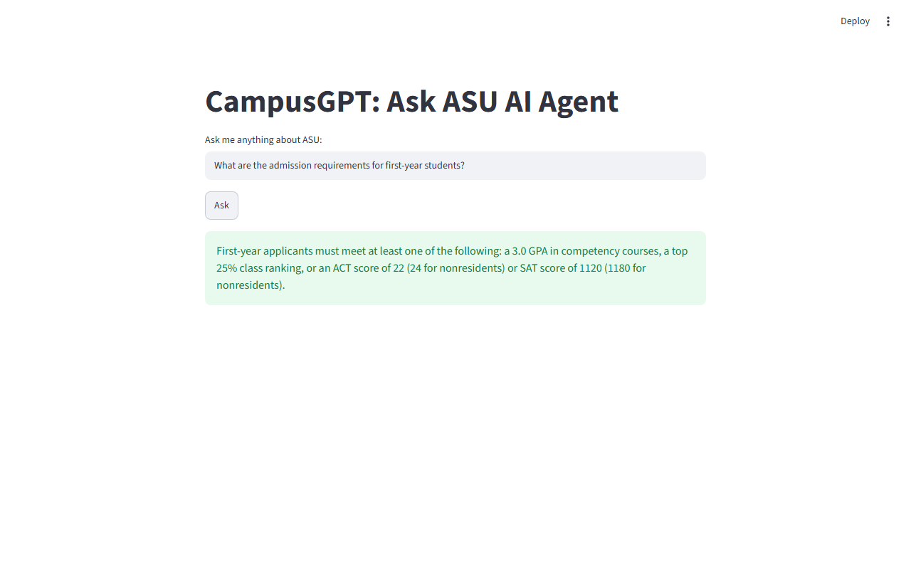
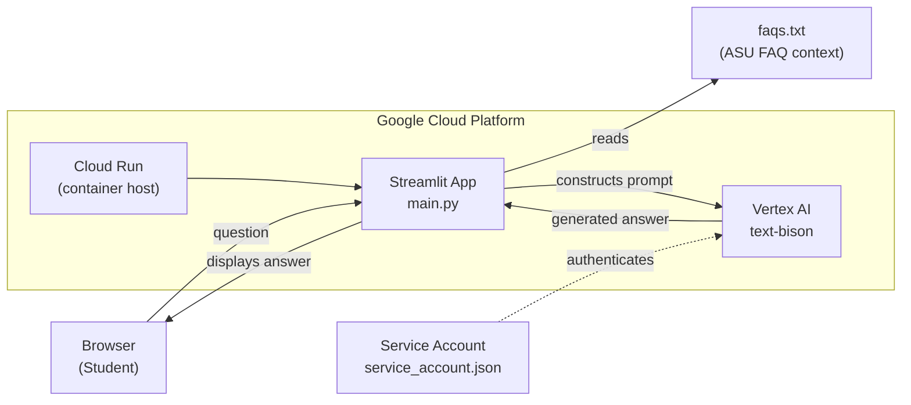

# CampusGPT

A Streamlit chatbot that answers Arizona State University (ASU) student questions using Google Vertex AI's `text-bison` foundation model, containerized and deployable to Google Cloud Run in minutes.

  

---

## Screenshots

**Landing page — clean single-input interface:**



**Answering a financial aid question:**



**Answering an admissions requirements question:**



---

## Overview

CampusGPT is a domain-grounded Q&A assistant for ASU students. It injects curated FAQ content directly into the prompt at inference time, anchoring the model's responses to verified university information — admissions requirements, financial aid, class registration, academic advising, and more. The result is a focused, low-hallucination assistant scoped to a single institution.

It targets students who need quick answers without navigating sprawling university websites, and developers learning how to build and deploy AI apps on Google Cloud.

---

## Highlights

- **Context injection without fine-tuning** — FAQ content is embedded in the prompt at runtime, constraining the model to institutional facts without any training runs or vector databases.
- **GCP end-to-end** — Vertex AI for inference, Cloud Build for container builds, Artifact Registry for image storage, and Cloud Run for serverless deployment; the full managed GCP stack.
- **Low-temperature generation** — `temperature=0.3` keeps answers factual and consistent, a deliberate choice over higher values that would introduce creative drift on an informational assistant.
- **Single-command deploy** — one `gcloud run deploy` command moves the container from Artifact Registry to a publicly accessible HTTPS endpoint with auto-scaling.
- **Zero infrastructure to maintain** — Cloud Run scales to zero when idle; no VMs, no clusters, no persistent servers.

---

## Features

### AI Q&A
- ASU-specific FAQ grounding via prompt injection
- Google Vertex AI `text-bison` model (PaLM 2 family)
- Configurable token budget (`max_output_tokens=256`) and temperature

### Interface
- Single-page Streamlit UI — text input, submit button, answer display
- Page title and icon configured for branded experience

### Infrastructure
- Dockerfile based on `python:3.10-slim`
- Cloud Run deployment with CORS disabled for clean browser access
- IAM service account with least-privilege roles (Vertex AI User, Cloud Run Invoker, Storage Object Viewer)

---

## Tech Stack

| Layer | Technology | Purpose |
|---|---|---|
| UI | Streamlit | Interactive web app frontend |
| AI Inference | Vertex AI (`text-bison`) | Text generation via PaLM 2 |
| Auth | Google Service Account (JSON key) | Authenticate to GCP from code |
| Language | Python 3.10 | Application logic |
| Containerization | Docker (`python:3.10-slim`) | Reproducible, portable runtime |
| Build | Google Cloud Build | CI-style container image build |
| Registry | Google Artifact Registry | Container image storage |
| Hosting | Google Cloud Run | Serverless, auto-scaling deployment |

---

## Architecture



---

## How It Works

1. **Startup** — The app loads `faqs.txt` into memory and initializes the Vertex AI client using credentials from `service_account.json`, targeting the `campusgpt-workshop` GCP project in `us-central1`.
2. **User input** — A student types a question into the Streamlit text input and clicks "Ask".
3. **Prompt construction** — The app builds a prompt that prepends the full FAQ document as context, followed by the user's question. This grounds the model's response without retrieval or embeddings.
4. **Inference** — `TextGenerationModel.predict()` calls the Vertex AI API with `temperature=0.3` and a 256-token output limit, keeping answers concise and factual.
5. **Response display** — The model's response is stripped of whitespace and shown to the user via `st.success()`.

---

## Setup

### Prerequisites

- Python 3.10+
- A GCP project with the following APIs enabled: Vertex AI, Cloud Run Admin, Cloud Build, Artifact Registry, IAM Service Account Credentials
- A service account JSON key with roles: `Vertex AI User`, `Cloud Run Invoker`, `Storage Object Viewer`

### Run Locally

```bash
# Install dependencies
pip install -r requirements.txt

# Place your service account key in the project root
cp /path/to/your-key.json service_account.json

# Start the app
streamlit run main.py
```

The app will be available at `http://localhost:8501`.

### Deploy to Google Cloud Run

```bash
# Build and push the container image
gcloud builds submit --tag gcr.io/campusgpt-workshop/campusgpt

# Deploy to Cloud Run
gcloud run deploy campusgpt \
  --image gcr.io/campusgpt-workshop/campusgpt \
  --platform managed \
  --region us-central1 \
  --allow-unauthenticated
```

> The service account JSON key is copied into the container at build time. For production, consider mounting it as a Secret Manager secret instead.

---

## Usage

Open the app in a browser. Type a question in the input field and click **Ask**.

**Example questions:**
- `What are the admission requirements for first-year students?`
- `How do I apply for financial aid?`
- `How do I register for classes?`
- `Can I take online and on-campus classes at the same time?`

**Sample response** for "How do I apply for financial aid?":

> Submit the Free Application for Federal Student Aid (FAFSA) at fafsa.gov. ASU's school code is 001081.

---

## Key Decisions

| Decision | Rationale | Tradeoff |
|---|---|---|
| Prompt injection over vector retrieval | Eliminates embedding infrastructure for a small, static FAQ set; simpler to deploy and reason about | Does not scale to large or frequently updated knowledge bases |
| `text-bison` (PaLM 2) via Vertex AI | Workshop context targets GCP; Vertex AI provides managed, quota-controlled access without API key management | Ties the project to GCP; not portable to other providers without code changes |
| `temperature=0.3` | Reduces hallucination and variance on factual Q&A; students expect consistent answers | Less creative phrasing; model may repeat FAQ wording closely |
| Service account JSON key in container | Simplest GCP auth approach for a workshop/demo context | Not suitable for production; key must be rotated and should be injected via Secret Manager for real deployments |
| Streamlit over a custom web framework | Minimal boilerplate; ships a functional UI in under 30 lines | Limited layout control; not suitable for complex multi-page applications |

---

## Innovation / Notable Work

The core engineering insight is using **zero-shot context injection** to create a domain-specific assistant without any fine-tuning, embeddings, or vector databases. By prepending the full FAQ document into each prompt, the model is effectively given a "memory" of institutional knowledge at inference time — a practical pattern for scoped assistants where the knowledge base is small and static.

The deployment pipeline demonstrates the minimal viable GCP stack for a containerized AI app: Cloud Build compiles the image, Artifact Registry stores it, and Cloud Run serves it with HTTPS and auto-scaling out of the box. The entire workflow from source code to public URL requires three `gcloud` commands.

---

## About

Built as a hands-on workshop project to demonstrate how to take a generative AI prototype from a local Streamlit script to a production-ready, serverless cloud deployment using Google Cloud's managed AI infrastructure. The project is intentionally minimal — its value is in the full path from prompt engineering to container to live URL, not in the feature count.
